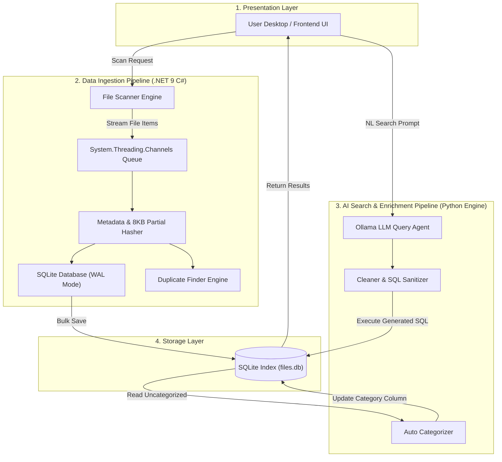

# AI File Manager

An intelligent, high-performance file indexing, deduplication, and natural language search engine powered by a **.NET 9 C# Backend** and a **Local Python AI Engine (Ollama)**.

---

## 🏗️ System Architecture & Pipelines

AI File Manager is built on a **Modular Micro-Pipeline Architecture**. The system decouples high-throughput file system scanning from AI-driven natural language query processing, ensuring fast disk indexing alongside local LLM query intelligence.

### Architecture Overview

---

### Pipeline Breakdown

#### 1. Ingestion & Indexing Pipeline (.NET 9 Backend Core)
* **Pattern**: Producer-Consumer ETL Pipeline
* **Backend Source**: [`backend/FileManager.Core`](file:///f:/AI-File-Manager/backend/FileManager.Core/Program.cs)
* **Description**:
  1. **Scan Stage**: `FileScanner` non-blockingly enumerates local drives and folders.
  2. **Transform Stage**: Extracts file metadata (`FileName`, `Extension`, `FileSizeBytes`, `FullPath`) and computes an **8KB partial hash** for size-matched files to identify duplicates instantly.
  3. **Load Stage**: Performs bulk batch inserts into SQLite using Write-Ahead Logging (WAL) mode for maximum disk I/O performance.

#### 2. AI Search & Enrichment Pipeline (Python AI Engine)
* **Pattern**: Natural Language to SQL (NL-to-SQL) + Rule-Based Enrichment
* **AI Source**: [`ai_engine/ai_agent.py`](file:///f:/AI-File-Manager/ai_engine/ai_agent.py) & [`ai_engine/categorizer.py`](file:///f:/AI-File-Manager/ai_engine/categorizer.py)
* **Description**:
  1. **Category Enrichment**: Rule-based extension classification categorizes files into `Documents`, `Images`, `Videos`, `Audio`, `Source Code`, `Archives`, and `Executable/Apps`.
  2. **NL Query Agent**: Translates natural language queries (e.g., *"find video files larger than 500MB"*) into SQLite `WHERE` clauses using local Ollama (`phi3`).
  3. **Sanitization & Execution**: Cleans raw LLM outputs, enforces strict path and column safety rules, and queries `files.db`.

#### 3. Continuous Integration & Deployment Pipeline (DevOps)
* **Pattern**: Dual-Runtime Automated Matrix Build
* **CI/CD Source**: [`.github/workflows/ci.yml`](file:///f:/AI-File-Manager/.github/workflows/ci.yml)
* **Description**: Automatically compiles `.NET 9.0` binaries, executes backend test suites, and verifies Python syntax on pull requests and pushes to `main`.

---

### Pipeline Summary Matrix

| Pipeline Stage | Architecture Pattern | Key Technologies Used | Primary Function |
| :--- | :--- | :--- | :--- |
| **Data Ingestion** | Producer-Consumer ETL | `.NET 9 Channels`, C# `FileScanner` | High-speed drive scanning & metadata extraction |
| **Deduplication** | 2-Phase Candidate Hashing | C# `DuplicateFinder`, SHA256 / 8KB Hash | Instant duplicate file detection |
| **Storage** | Write-Ahead Logging (WAL) | SQLite (`files.db`) | High-throughput concurrent metadata indexing |
| **AI Enrichment** | Rule-Based Classifier | Python 3.10, `categorizer.py` | Extension-based file categorization |
| **AI NL Search** | LLM Natural Language to SQL | Ollama (`phi3`), `ai_agent.py` | Converts natural language prompts into raw SQL queries |
| **CI / CD** | Automated Matrix Workflow | GitHub Actions, `.NET 9 SDK`, Python Actions | Build validation, syntax checking, & CI automation |
